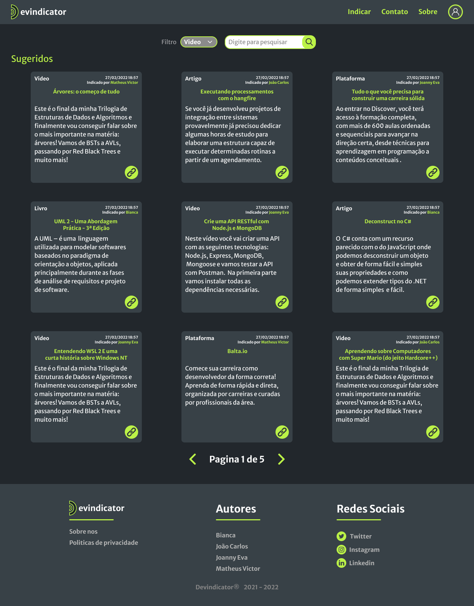

<h1>Devindicator</h1>
<h2>proposta</h2>

    O <strong>Devindicator</strong> foi pensado para situar a busca de informações através de ferramentas que unem e promovem a indicação de sites, livros, vídeos, artigos, projetos, plataformas, notícias e dicas com o olhar voltado para programadores, estudantes e profissionais da área de tecnologia, onde todo o conteúdo do site é indicado pelos próprios usuários, fazendo com que os conteúdos sejam compartilhados mais rapidamente, o que facilitaria ao usuário o encontro de materiais e novas ideias

<h2>Bibliotecas utilizadas: </h2>

<h3>backend</h3>
    <ul>
        <li>mongoose: <a>https://mongoosejs.com/docs/guide.html</a></li>
        <li>bcrypt: <a>https://www.npmjs.com/package/bcrypt</a></li>
        <li>express: <a>https://expressjs.com/pt-br/</a></li>
        <li>nodemon: <a>https://www.npmjs.com/package/nodemon</a></li>
    </ul>
<h3>frontend</h3>
 <ul>
        <li></li>
        <li></li>
        <li></li>
        <li></li>
</ul>

<h2>capturas de tela<h2/>
